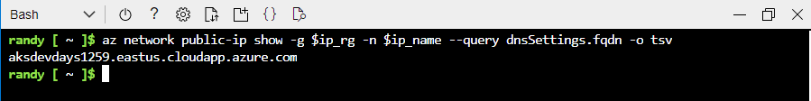
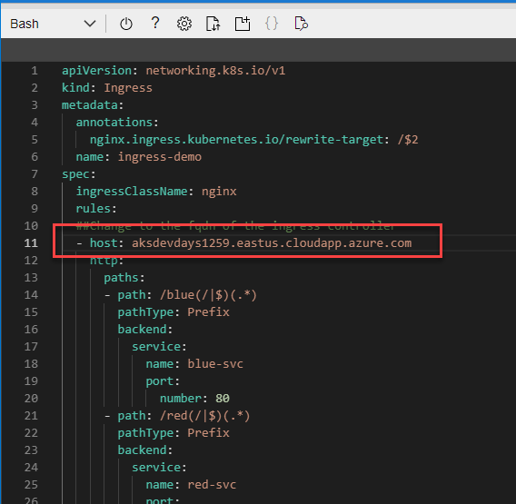
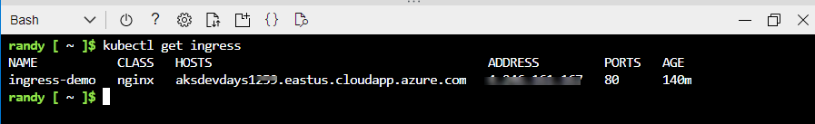

## Install NGINX Ingress controller 


### Create a Public IP Address with Fully Qualified Domain Name (FQDN)

Get the node resource group name for the AKS cluster created elarier
``` bash
ingress_dns=$aks_name
ip_rg=$(az aks show -n $aks_name -g $rg --query nodeResourceGroup -o tsv)
ip_name=$aks_name"-ip"
```

Create the  public IP Address
``` bash
az network public-ip create -g $ip_rg -n $ip_name --dns-name $ingress_dns --allocation-method Static --sku Standard --query dnsSettings.fqdn
```
Get the IP Adress to assign to the Ingress Controller
``` bash
ingress_ip=$(az network public-ip show -g $ip_rg -n $ip_name --query ipAddress -o tsv)
```


### Install an ingress controller using the new IP Address
``` bash
helm repo add ingress-nginx https://kubernetes.github.io/ingress-nginx
helm repo update
helm install ingress-nginx ingress-nginx/ingress-nginx \
  --create-namespace \
  --namespace ingress-basic \
  --set controller.service.annotations."service\.beta\.kubernetes\.io/azure-load-balancer-health-probe-request-path"=/healthz \
  --set controller.service.loadBalancerIP=$ingress_ip
```

### Deploy Applications 
Deploy 2 web servers one with a <span style=color:blue>Blue</span> background and one with a <span style=color:red>Red</span> background and 2 Internal [ClusterIP](https://kubernetes.io/docs/concepts/services-networking/service/#publishing-services-service-types) Services

``` bash
kubectl apply -f blue-deploy.yaml -f red-deploy.yaml
```


### Update ingress.yaml file to replace host with ingress domain name 
Get the Ingress Conroller Domain Name and copy to clipboard
``` bash
az network public-ip show -g $ip_rg -n $ip_name --query dnsSettings.fqdn -o tsv
```
> NOTE:</br>
Your Domain Name will be different
>



Edit ingress.yaml file and replace string **"[Replace]"** with your domain name from previous step 

```bash 
code ingress.yaml
```


Next: Save "ctrl+s" and quit editor "ctrl+q"

create ingress rules
``` bash
kubectl apply -f ingress.yaml
```

An incomming URL starting with <span style=color:blue>/blue</span> will be routed to the **blue-svc** service and a URL starting with <span style=color:red>/red</span> will be routed to the **red-svc**

```yaml
apiVersion: networking.k8s.io/v1
kind: Ingress
metadata:
  annotations:
    nginx.ingress.kubernetes.io/rewrite-target: /$2
  name: ingress-demo
spec:
  ingressClassName: nginx
  rules:
  ##Change to the fqdn of the ingress controller
  - host: [Replace]
    http:
      paths:
      - path: /blue(/|$)(.*)
        pathType: Prefix
        backend:
          service: 
            name: blue-svc
            port: 
              number: 80
      - path: /red(/|$)(.*)
        pathType: Prefix
        backend:
          service: 
            name: red-svc
            port: 
              number: 80
```


``` bash
kubectl get ingress
```


## Cleanup
```bash
kubectl delete -f blue-deploy.yaml -f red-deploy.yaml -f ingress.yaml
```