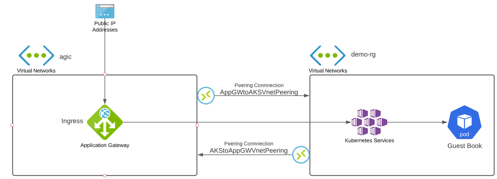

# Setup Azure Application Gateway for AKS Ingress

[Setup Ingress Azure App Gateway](https://learning.oreilly.com/library/view/hands-on-kubernetes-on/9781801079945/B17338_06_ePub.xhtml#_idParaDest-73)

[See Also](https://azure.github.io/application-gateway-kubernetes-ingress/how-tos/networking/#deployed-in-different-vnets)


#### Create AKS
```bash
# Sign-in to your subscription if you're not already signed-in.
az login

# Create the resource group for AKS
az group create --name demo-rg --location eastus

# Create the AKS cluster
az aks create --resource-group demo-rg --name demo-aks --node-count 2 --generate-ssh-keys

# Merge AKS credentials into ./kube/config, so you can run kubectl commands.
az aks get-credentials --resource-group demo-rg --name demo-aks

```

#### Create Azure App Gateway

```bash
# Create resource group for app gaetway
az group create -n agic -l eastus

# Create public IP Address and assign a domain name
az network public-ip create -n agic-pip -g agic --allocation-method Static --sku Standard --dns-name "[Replace-with-DNS]"

# Create VNET for gateway
az network vnet create -n agic-vnet -g agic --address-prefix 192.168.0.0/24 --subnet-name agic-subnet --subnet-prefix 192.168.0.0/24

# Create App Gateway
az network application-gateway create -n agic -l eastus -g agic --sku Standard_v2 --public-ip-address agic-pip --vnet-name agic-vnet --subnet agic-subnet
```
#### Add App Gateway as AKS Ingress

```bash
#get the gateway ID 
appgwId=$(az network application-gateway show -n agic -g agic -o tsv --query "id")

#enable integration between App Gateway and and AKS
az aks enable-addons -n demo-aks -g demo-rg -a ingress-appgw --appgw-id $appgwId
```

#### Peer app gateway VNET and AKS VNET 
```bash
# Get the resource group for the AKS Nodes
nodeResourceGroup=$(az aks show -n demo-aks -g demo-rg -o tsv --query "nodeResourceGroup")

# Get AKS VNET
aksVnetName=$(az network vnet list -g $nodeResourceGroup -o tsv --query "[0].name")

# Get AKS VNET id
aksVnetId=$(az network vnet show -n $aksVnetName -g $nodeResourceGroup -o tsv --query "id")

# Setup Peering between App Gateway VNET and AKS VNET
az network vnet peering create -n AppGWtoAKSVnetPeering -g agic --vnet-name agic-vnet --remote-vnet $aksVnetId --allow-vnet-access

appGWVnetId=$(az network vnet show -n agic-vnet -g agic -o tsv --query "id")

# Setup reverse Peering between AKS VNET and App Gateway VNET
az network vnet peering create -n AKStoAppGWVnetPeering -g $nodeResourceGroup --vnet-name $aksVnetName --remote-vnet $appGWVnetId --allow-vnet-access
```

# TODO: Install guestbook and ingress rules

## [NEXT](cert-manager.md)