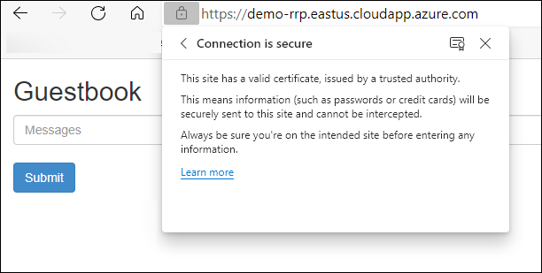

# Adding TLS to an Ingress
You will now add HTTPS support to your application. To do this, you need a TLS certificate. You will be using the cert-manager Kubernetes add-on to request a certificate from Let's Encrypt.

4 steps to adding TLS certificates to the Application Gateway Ingress created [here](readme.md)

1. Install cert-manager, which interfaces with the Let's Encrypt API to request a certificate for the domain name you specify.

1. Install the certificate issuer, which will get the certificate from Let's Encrypt.

1. Create an SSL certificate for a given Fully Qualified Domain Name (FQDN). An FQDN is a fully qualified DNS record that includes the top-level domain name (such as .org or .com). You created an FQDN linked to your public IP for your Application Gateway Ingress [here](readme.md). 

1. Secure the front-end service by creating an ingress to the service with the certificate created in step 3. In the example in this section, you will not be executing this step as an individual step. You will, however, reconfigure the ingress to automatically pick up the certificate created in step 3.

## Installing Cert-Manager 
[**cert-manager**](https://github.com/jetstack/cert-manager) is a Kubernetes add-on that automates the management and issuance of TLS certificates from various issuing sources. It is responsible for renewing certificates and ensuring they are updated periodically

>### **Note**
>
>The cert-manager project is not managed or maintained by Microsoft. It is an open-source solution previously managed by the company Jetstack, which recently donated it to the Cloud Native Computing Foundation.

\* The the latest installations instructions see the [Documentation](https://cert-manager.io/docs/installation/kubernetes/)

```bash
kubectl apply -f https://github.com/jetstack/cert-manager/releases/download/v1.3.1/cert-manager.yaml
```
This will install a number of components in your cluster as shown in Figure 6.8. A detailed explanation of these components can be found in the cert-manager documentation at https://cert-manager.io/docs/installation/kubernetes/.

**cert-manager** makes use of a Kubernetes functionality called **CustomResourceDefinition** (CRD). CRD is a functionality used to extend the Kubernetes API server to create custom resources. In the case of cert-manager, there are six CRDs that are created, some of which you will use later in this chapter.

Now that you have installed cert-manager, you can move on to the next step: setting up a certificate issuer.

## Installing Certificate Issuer
In this section, you will install the Let's Encrypt certificate issuer. This issuer will automatically generate certificates for you

>### **Note**
>
>Replace the email in the YAML file with a valid email or Let's Encrypt will fail to issue a certificate

```yaml
spec:
  acme:
    server: https://acme-v02.api.letsencrypt.org/directory
    email: "[replace-with-valid-email]"
    privateKeySecretRef:
```
Install the Let's Encrypt Certificate Issuer
```bash
kubectl create -f certificate-issuer.yaml
```
\* For additional information on how domain validation works see the [Documentation](https://cert-manager.io/docs/tutorials/acme/http-validation/)

## Create Certificate and secure Ingress
In this section, you will create a TLS certificate. There are two ways you can configure cert-manager to create certificates. You can either manually create a certificate and link it to the ingress, or you can configure your ingress controller, so cert-manager automatically creates the certificate.

In order for the cert-manager to generate and assign a "Let's Encrypt" certificate you need to add two annotation to the  ingress

```yaml
  annotations:
    cert-manager.io/issuer: letsencrypt-prod
    cert-manager.io/acme-challenge-type: http01
```
You can update the ingress you created earlier with the following command:
```bash
kubectl apply -f ingress-with-tls.yaml
```
It takes cert-manager about a minute to request a certificate and configure the ingress to use that certificate. While you are waiting for that, let's have a look at the intermediate resources that cert-manager created on your behalf.

cert-manager created a certificate object for you. You can look at the status of that object using the following:
```bash
kubectl get certificate
```

the output should look somehting like this
```bash
$ kubectl get certificate
NAME                READY   SECRET              AGE
frontend-prod-tls   False   frontend-prod-tls   51m
```
As you can see, the certificate isn't ready yet. There is another object that cert-manager created to actually get the certificate. This object is **certificaterequest**. You can get its status by using the following command:
```bash
kubectl get certificaterequest
```
The output should look something like this:

```bash
$ kubectl get certificaterequest
NAME                 APPROVED   DENIED   READY   ISSUER                REQUESTOR                                         AGE
frontend-tls-85vqj   True                False   letsencrypt-staging   system:serviceaccount:cert-manager:cert-manager   7s
```

>#### NOTE:
>you can use **kubectl describe** on these objects to get additional information on the certificate process

Wait until the **certificaterequest** is **Ready** then navigate to your Guestbook application using **https://**.  It may take a few browser refreshed before the web page appears.




